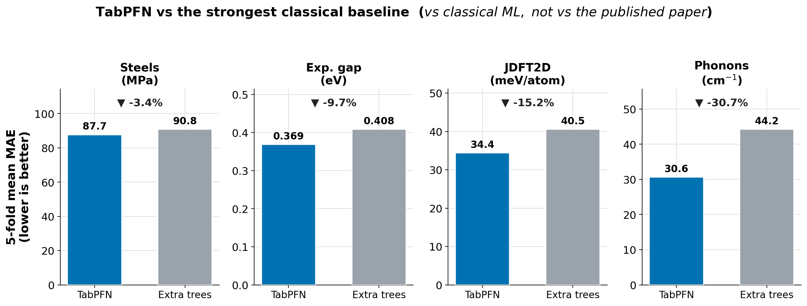
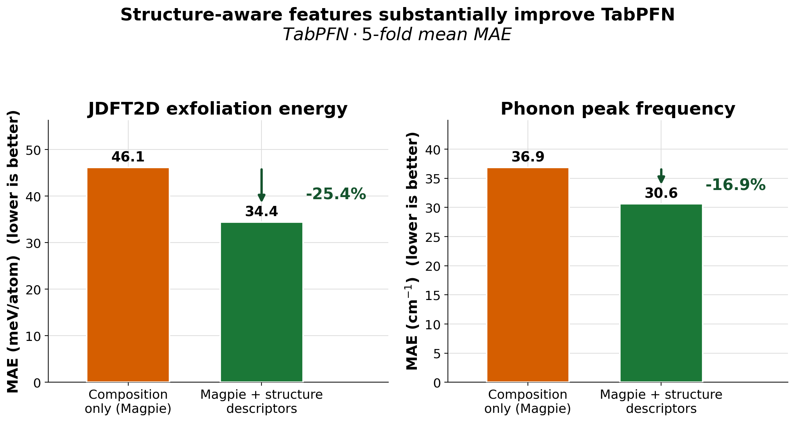
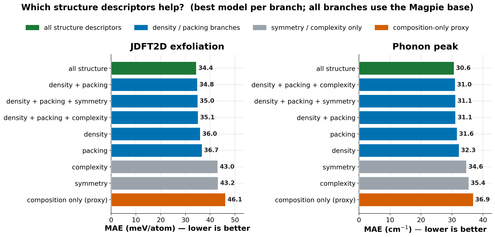
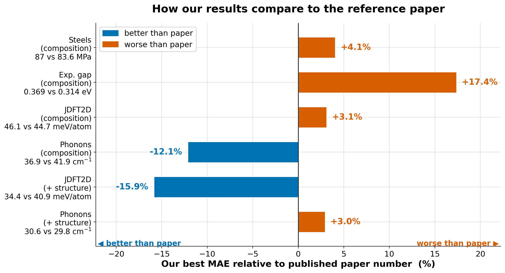
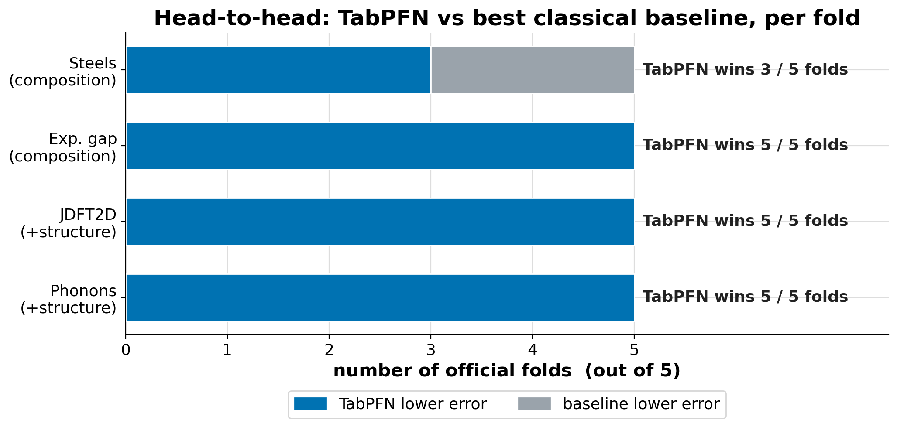
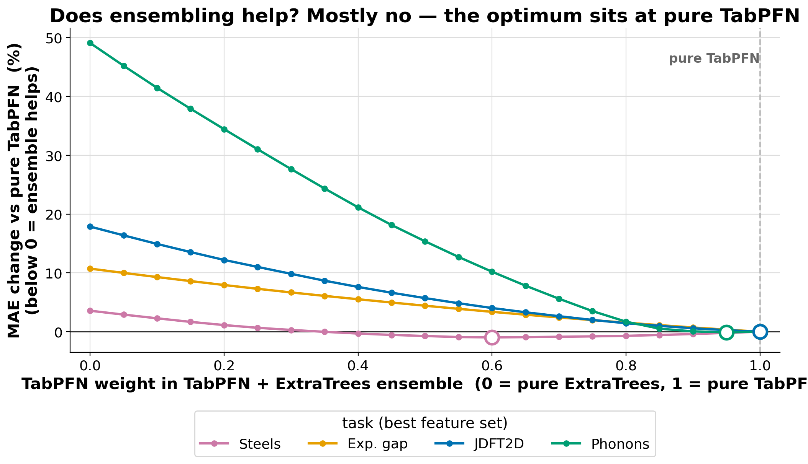

# Presentation Script — TabPFN / ICL-FM for Small-Data Materials Property Prediction

**Scope:** Uses only the first result set (`results/`). Figures are the slide-ready graphs in `presentation_graphs/` (fig1–fig10).

**Take-home message (say it three times — open, middle, close):**
> On small materials datasets, the **feature representation decides the result** — adding lightweight structure descriptors cuts TabPFN's error by 17–25%, more than the choice of model does.

**Target length:** 11 slides ≈ 9–10 min (inside the 7–10 min window). One idea and ≤1 figure per slide. To trim toward 8 min, shorten Slide 4 (the code-level detail lives in the appendix reproducibility card) and/or cut Slide 9.

### Design principles applied (from authoritative sources)
This script was revised to follow evidence-based presentation guidance:
- **Message headlines, not topic labels** — every slide title is a full-sentence *assertion* the figure then supports (Alley, *Assertion-Evidence*; Naegle PLOS Rule 3).
- **One idea per slide, ≤1 visual per slide, ~1 min each** (Naegle Rules 1–2, 6; Bourne Rule 8) — the old combined R²+ensemble slide is now two single-idea slides.
- **One persistent take-home, repeated** (Bourne Rule 4; Nature "tell a story").
- **Narrative arc with a "but"**: context → promise → *but* it's not automatic → *therefore* features decide (Nature).
- **≤6 short elements per slide, phrases not sentences; figure carries the evidence** (Naegle Rule 7).
- **Give credit** — paper, data, and tools cited on the slides (Naegle Rule 5).
- Delivery checklist and sources at the bottom. (Full source list under **Sources**.)

**How to read this doc:** each slide shows its on-slide bullets first, then the figure (if any), then one paragraph of what to say.

---

## Slide 1 — "On small data, the representation decides — not just the model" *(0.5 min)*

**On slide:**
- **TabPFN / ICL-FM for Small-Data Materials Property Prediction**
- Reproduction-style Matbench study (composition + structure-informed features)
- *Take-home:* features decide the result, more than the model
- [Your name] · [Course / date]

**Speaker script:**
Hi everyone. My project asks a practical question: when materials datasets are small, can an in-context tabular foundation model — TabPFN — predict properties well, and does the *feature representation* change the answer? I ran this as a staged reproduction of the ICL-FM paper on the official Matbench benchmark — both its composition setting and its structure-informed feature setting. If you remember one thing from this talk, let it be this: on small materials data, the representation decides the result — even more than the choice of model.

---

## Slide 2 — "Small, expensive materials data is exactly where a foundation model should help" *(0.75 min)*

**On slide:**
- Materials labels are scarce and expensive (experiments / DFT)
- Small data → deep models struggle, features dominate
- TabPFN: in-context prediction, no per-task training
- *Question:* does that promise hold on real Matbench tasks?

**Speaker script:**
This builds directly on our labs. Lab 1 set up supervised property prediction, and Lab 2 showed that the descriptors you choose can matter more than the model. The catch in real materials science is that datasets are often only a few hundred to a few thousand samples, because each label is an expensive experiment or DFT calculation. That is exactly the regime where deep models struggle — and where a pretrained tabular foundation model like TabPFN should shine, because it predicts in-context without task-specific training. So the question is whether that promise actually holds on real Matbench tasks, and what role the features play.

---

## Slide 3 — "ICL-FM = TabPFN predicting in one pass from descriptors given as context" *(0.75 min)*

**On slide:**
- **ICL-FM** = *In-Context Learning Foundation Model* · **TabPFN** = *Tabular Prior-Data Fitted Network*
- TabPFN: training rows as *context* → predict held-out rows in one forward pass
- ICL-FM = TabPFN + materials descriptors, in 3 input regimes:
  - composition (Magpie / MagpieEX) · structure-informed Magpie · GNN embeddings (ALIGNN/CGCNN)
- Reports composition **and** structure numbers → my comparison targets
- *Credit:* Li et al., npj Comput. Mater. (2026)

**Speaker script:**
The method is called ICL-FM — the in-context-learning foundation model. The engine is TabPFN, the Tabular Prior-Data Fitted Network, a transformer pretrained on millions of synthetic tabular datasets; instead of fitting weights to your data, you hand it the training rows as context and it predicts the test rows in a single forward pass. The paper runs TabPFN under three input regimes: composition descriptors — Magpie and their extended MagpieEX — structure-informed Magpie descriptors derived from the crystal, and graph-embedding features extracted from ALIGNN and CGCNN. Crucially, it reports both composition- and structure-based numbers on Matbench, which gives me concrete, published targets to compare against.

---

## Slide 4 — "The method, end to end: official folds, matminer features, one pipeline per model" *(1.25 min)*

**On slide:**

| Task | Samples | Target | Unit | Input |
|---|---:|---|---|---|
| steels | 312 | yield strength | MPa | composition |
| jdft2d | 636 | exfoliation energy | meV/atom | structure |
| phonons | 1,265 | phonon peak freq. | cm⁻¹ | structure |
| expt_gap | 4,604 | experimental band gap | eV | composition |

- **Data:** `matbench` package → official **5-fold** train/test splits (fixed, identical for everyone)
- **Features (matminer):** Magpie composition (~132 desc.) + structure: density · packing · symmetry · complexity
- **Models (one `sklearn` Pipeline each, median-impute):** Dummy · RidgeCV · RandomForest · ExtraTrees · HistGB · **TabPFN** — *same feature matrix for all*
- **Per fold:** fit on train → predict test → MAE + R²; average 5 folds; **seed 42, no test-fold tuning**
- *Full code-level recipe (versions, hyperparameters) → reproducibility card in the appendix*

**Speaker script:**
Here's the whole method, so you could rerun it. The data comes straight from the Matbench Python package — I build a MatbenchBenchmark for each task and use its official five-fold splits, so they're fixed and identical to everyone else's. Features come from matminer: the Magpie preset turns each composition into about 132 elemental-statistics descriptors, and for the two structure tasks I add four lightweight structure descriptors on top of Magpie — density, maximum packing efficiency, global symmetry, and structural complexity. Featurization is per-material and uses no labels, so I compute it once for all rows; there's no leakage. Every model is a scikit-learn pipeline that starts with median imputation — ridge also standardizes — and the lineup is RidgeCV, random forest and extra trees with 500 trees each, histogram gradient boosting, and TabPFN with eight ensemble members on a GPU; crucially every model sees the exact same feature matrix. The loop is simple: for each of the five official folds, fit on the training rows, predict the held-out test rows, and record MAE and R-squared; then I average across folds, fix the seed at 42, and never tune on the test folds. The exact package versions and hyperparameters are on the reproducibility card in the appendix.

---

## Slide 5 — "TabPFN beats every classical baseline — but only when the features are good" *(1 min)*

**On slide:**
- TabPFN beats the strongest baseline (Extra Trees) on all 4 tasks (~3% → ~31%)
- Margin grows with a richer representation
- Good features + a classical model can beat TabPFN + weak features



**Speaker script:**
First the internal comparison: how does TabPFN do against my best classical model, Extra Trees, on each task's best feature set? TabPFN wins on all four — by about 3% on steels, 10% on band gap, 15% on exfoliation energy, and 31% on phonons. Notice the margin grows as the representation gets richer. And here is the first hint of my main point: if I restrict TabPFN to composition-only features, a plain Extra Trees model that *gets* the structure features actually beats it — winning all five folds on exfoliation energy. So the features matter at least as much as the model — which is why I treat this as a representation study, not a "TabPFN always wins" claim.

---

## Slide 6 — "Structure-aware features cut TabPFN's error by up to 25%" *(1.25 min — the headline)*

**On slide:**
- jdft2d: **46.1 → 34.4 meV/atom (−25%)**
- phonons: **36.9 → 30.6 cm⁻¹ (−17%)**
- Matches the physics: arrangement, not just composition



**Speaker script:**
This is the central result. For the two structure-input tasks, I started from composition-only Magpie features — a deliberately handicapped "proxy" baseline — and then added lightweight structure descriptors from matminer: density, packing, symmetry, and structural complexity. The effect is large. On exfoliation energy the TabPFN error drops about 25%, from 46 to 34 meV per atom, and on phonons about 17%, from 37 to 31 inverse centimeters. Physically this is no surprise — exfoliation energy and phonon frequencies depend on how atoms are *arranged*, not just which elements are present — but it's a clean, quantitative confirmation that for structure-dependent properties, composition alone is not enough, and the model exploits structure when you give it.

---

## Slide 7 — "Density and packing descriptors drive almost all of the gain" *(1 min)*

**On slide:**
- Best branch on both tasks: **Magpie + all structure**
- Density & packing carry most of the improvement
- Symmetry-only / complexity-only are weak (~6% vs ~25%)



**Speaker script:**
Naturally the next question is *which* descriptors do the work, so I ran an ablation, adding each family on top of Magpie. The best branch on both tasks uses all structure descriptors together — but the contribution is uneven: density and packing carry most of the improvement, while symmetry alone or complexity alone give only a small fraction — roughly a 6% gain versus the 25% you get from the full set on exfoliation energy. The takeaway is that the improvement is real and physically interpretable: it comes from geometric, packing-related descriptors, not from a generic "more features is better" effect.

---

## Slide 8 — "Our numbers sit close to the paper — but not a win over it" *(1.5 min)*

**On slide:**
- fig2: my best MAE vs the paper's best published number, 6 settings
- 4 of 6 at/behind the paper (steels +4%, band gap +17%, jdft2d-comp +3%, phonons-struct +3%)
- 2 of 6 numerically better — **explainable, not validated wins**:
  - **phonons-comp:** −12% vs their MagpieEX, −21% vs their *same* plain Magpie (≈13 SEM, not noise); yet +3% *worse* on jdft2d with the same features ⇒ version/preprocessing, needs rerun
  - **jdft2d-struct −16%:** cross-representation — my structure-informed Magpie (Tables S10–S11) vs their GNN/FMEF embeddings; tiny 636-sample task (≈1.7 SEM → mostly variance)
- *Not* overfitting/leakage: official folds · no test-fold tuning · TabPFN trains nothing



*Source of paper numbers: Table 1 (composition), Table 2 (structure/FMEF & SOTA), Supplementary Table S13 (steels, band gap).*

**Speaker script:**
Now the external comparison — where I'm most careful. This shows my best MAE against the paper's best number across six settings. On four I'm at or behind the paper; on two I appear to win — phonons on composition and jdft2d with structure — but I read both as artifacts, not breakthroughs. Take phonons: the 12% on the chart is against the paper's best composition model, their extended MagpieEX. But the fair check is the identical setup — plain Magpie into TabPFN — and there the paper reports 46.5 while I get 36.9, a 21% gap, more than ten times my fold-to-fold error. So it isn't noise, but two implementations of the same method shouldn't differ that much — it almost certainly comes from a TabPFN version or preprocessing difference. The tell is that with those same features on jdft2d I'm actually 3% *worse* — same method, opposite direction on another task — and my phonons number is below every published composition result, so I'd rerun it before claiming anything. The jdft2d-structure win is different: there I'm comparing my structure-informed Magpie — the family the paper defines in Tables S10 and S11 — against their GNN embeddings, so different inputs entirely, on a 636-sample task where the gap is under two standard errors, mostly variance. And to rule out the obvious worry, this isn't overfitting or leakage: official Matbench folds, no test-fold tuning, and TabPFN does no weight training. Overall, we reproduce the paper's ballpark — competitive on the structure tasks, behind on band gap — but we match it, we don't beat it.

---

## Slide 9 — "The structure-feature win holds on every fold" *(0.5 min)*

**On slide:**
- Wins 5/5 folds on jdft2d, phonons, band gap; 3/5 on steels
- Consistent across folds → the gain is not luck
- Honest caveat: jdft2d R² ≈ 0.4 → still the hardest task



**Speaker script:**
Is this gain just luck on one split? No. With the structure features, TabPFN beats the best classical baseline on all five official folds for exfoliation energy, phonons, and band gap, and on three of five for steels — so the win is consistent, not driven by one lucky fold. The one honest caveat is fit quality: even with structure, exfoliation energy only reaches an R-squared around 0.4, so it stays the hardest of the four tasks — there's real headroom left there.

---

## Slide 10 — "It's the features, not an ensemble trick" *(0.5 min)*

**On slide:**
- Swept the TabPFN ↔ Extra Trees mixing weight (full range)
- Best blend ≤ 1% better on the headline branches → essentially noise
- Gain comes from the **representation**, not from stacking models



**Speaker script:**
One more integrity check: could a simple ensemble be doing the work instead of the features? I swept the mixing weight between TabPFN and Extra Trees across the full range, and the best blend improves MAE by at most about one percent — essentially noise. So the gains come from the representation, not from stacking models together. That's the cleaner and more defensible story, and it's a deliberate negative result I think is worth showing.

---

## Slide 11 — "Take-home: on small data, the representation decides the result" *(1 min)*

**On slide:**
- TabPFN: strong small-data predictor — but not universally SOTA
- **Representation is the decisive factor**
- Structure-informed Magpie descriptors → large gains on structure tasks
- Next: implement the paper's ALIGNN/CGCNN (FMEF) route for a same-representation comparison
- *Thanks — questions welcome* · acknowledgments to [advisor / course]

**Speaker script:**
To wrap up: TabPFN is a strong, easy-to-use predictor on small materials datasets, and it beat every classical baseline I tried — but it is not automatically state of the art, and it does not uniformly beat the published paper. The scientifically important result is the one I opened with: the feature representation is decisive. Adding physically meaningful structure descriptors cut TabPFN's error by 17 to 25% on the structure-dependent tasks — the clearest demonstration that representation, not the model, drives accuracy here. The natural next step is to implement the paper's graph-derived ALIGNN and CGCNN embeddings — the FMEF route I skipped — for a true same-representation comparison. Thank you — and thanks to [advisor / course]. I'm happy to take questions.

---

## Appendix / backup slides (anticipate questions — Bourne Rule on Q&A)

Keep out of the main flow; pull up on demand.

- **Fit quality by task (R²):** `../presentation_graphs/fig7_r2_by_task.png` — for "how well does it actually fit?"
- **Full model leaderboard** (all models, per task): `../presentation_graphs/fig3_model_leaderboard.png`.
- **Fold-level MAE spread** (stability of each model): `../presentation_graphs/fig6_fold_distribution.png`.
- **Parity plots** (predicted vs actual, best branch): `../presentation_graphs/fig10_tabpfn_parity.png` — good for "why is jdft2d hard?"

**"Why are two results better than the paper?" (numbers for Q&A):**

| Setting | Mine | Paper | Δ | Read |
|---|---:|---|---:|---|
| phonons · composition | 36.9 (Magpie) | 46.5 FM-Magpie / 41.9 FM-MagpieEX | −21% / −12% | **same representation**, gap ≈ 13 SEM → not noise; but +3% *worse* on jdft2d with same features (opposite direction) and below the published composition SOTA (46.6) → implementation/version difference; rerun on the paper's pipeline |
| jdft2d · composition *(control)* | 46.1 (Magpie) | 44.7 FM-Magpie | **+3%** | with the *same* features on the small task (509 train/fold) I'm **worse** → no universal advantage |
| jdft2d · structure | 34.4 (struct-Magpie) | 40.9 FMEF (GNN emb.) | −16% | **cross-representation**; the paper's FMEF beat its own ALIGNN baseline by only +0.6% and lost to SOTA 33.2; gap ≈ 1.7 SEM (partly variance) |
| phonons · structure | 30.6 (struct-Magpie) | 29.8 FMEF | +3% | essentially matches |

- **Could it be overfitting / leakage?** Unlikely by construction: official Matbench folds, no test-fold tuning, and TabPFN does **no** gradient training. The one residual bias: choosing the best of ~8 structure branches adds mild optimistic selection.
- **Cleanest validating experiment:** rerun the paper's exact composition setting (same TabPFN version + Magpie pipeline) and implement the FMEF/GNN route, so phonons-comp and jdft2d-struct become same-representation comparisons.

---

## Reproducibility — exact recipe (reference card)

*Everything below is enough to reproduce the numbers. Entry points: `notebooks/matbench_tabpfn_official_folds.ipynb` or `configs/gpu_rerun.yml`. `random_seed = 42` throughout.*

**Environment.** conda env `matbench-tabpfn` (`bash scripts/setup_env.sh`); core deps `matbench`, `matminer`, `pymatgen`, `scikit-learn`, `tabpfn`, `torch` (CUDA). TabPFN needs a **GPU** and a **token** — set `TABPFN_TOKEN` via env var / the notebook prompt (don't commit it).

**1 · Data — official folds (per task).**
```python
from matbench.bench import MatbenchBenchmark
b = MatbenchBenchmark(autoload=False, subset=[task_name])
task = list(b.tasks)[0]; task.load()
for fold in task.folds_nums:                  # 0..4, fixed official splits
    X_tr, y_tr = task.get_train_and_val_data(fold)
    X_te, y_te = task.get_test_data(fold, include_target=True)
```
Tasks: `matbench_steels`, `matbench_expt_gap` (composition); `matbench_jdft2d`, `matbench_phonons` (structure).

**2 · Features — matminer (compute once for all rows; unsupervised → leak-free).**
```python
from matminer.featurizers.composition import ElementProperty
from matminer.featurizers.structure import (
    DensityFeatures, MaximumPackingEfficiency,
    GlobalSymmetryFeatures, StructuralComplexity)
ElementProperty.from_preset("magpie")         # ~132 composition descriptors
# structure tasks: Magpie from structure.composition, then add the 4 groups above
```
Feature sets = Magpie alone, or Magpie + {density, packing, symmetry, complexity} singly / combined; **"all structure"** = all four. Clean each frame: bool→int, one-hot categoricals, coerce numeric, inf→NaN.

**3 · Models — one `sklearn` Pipeline each, `SimpleImputer(strategy="median")` first.**

| Model | Spec |
|---|---|
| Dummy | `DummyRegressor(strategy="mean")` |
| RidgeCV | `+ StandardScaler`, `alphas = logspace(-6, 6, 25)` |
| RandomForest / ExtraTrees | `n_estimators=500, random_state=42, n_jobs=-1` |
| HistGB | `max_iter=500, learning_rate=0.04, l2_regularization=0.01, early_stopping=True` |
| **TabPFN** | `TabPFNRegressor(n_estimators=8, device="cuda", random_state=42)`; predict in batches of 128 |

**4 · Evaluate.** Per fold: `model.fit(X_tr, y_tr)` → `predict(X_te)` → `mean_absolute_error`, `r2_score`. Aggregate **mean / std / SEM** over the 5 folds. No test-fold tuning.

**5 · Diagnostics (post-hoc, optional).** Fixed 50/50 TabPFN+ExtraTrees (average the saved predictions); inner-tuned ensemble (split each train fold 80/20, scan TabPFN weight 0→1 in 21 steps, pick best inner-validation MAE, apply to the official test fold) — both leakage-free.

---

## Delivery checklist (apply on the day)

- **Don't read the slides.** The headline states the message; the figure is the evidence; you narrate. Look up and engage the room (Nature; Alley).
- **One visual per minute, max** — pace ≈ 1 slide/min (Bourne Rule 8; Naegle Rule 2).
- **Repeat the take-home** at the open, the middle (Slide 6), and the close (Bourne Rule 4).
- **Practice and time it** out loud at least twice; trim Slide 9 first to hit 7 min, expand Slide 6 to fill 10 (Bourne Rule 7; Naegle Rule 9).
- **Save as PDF + keep this script as backup** in case of tech issues (Naegle Rule 10).
- **Anticipate Q&A** with the appendix figures above.

### Timing summary

| Slide | Message | Figure | Min |
|---|---|---|---:|
| 1 | Representation decides (title + take-home) | — | 0.5 |
| 2 | Small data → foundation model should help | — | 0.75 |
| 3 | ICL-FM = TabPFN in-context on descriptors | — | 0.75 |
| 4 | Method end-to-end (data/features/models/protocol) | — | 1.25 |
| 5 | TabPFN wins — but only with good features | fig5 | 1.0 |
| 6 | Structure features cut error up to 25% | fig1 | 1.25 |
| 7 | Density/packing drive the gain | fig4 | 1.0 |
| 8 | Close to the paper, not a win | fig2 | 1.5 |
| 9 | Win holds on every fold | fig9 | 0.5 |
| 10 | It's the features, not an ensemble | fig8 | 0.5 |
| 11 | Take-home: representation decides | — | 1.0 |
| | **Total** | | **~10.0** |

*(Pure speaker text ≈ 8.5 min; the ~10.0 budget includes slide transitions. Near the top of the window — to buy slack, shorten Slide 4 since the full recipe is in the appendix card.)*

---

## Sources (presentation best practices)

- Naegle, K. M. (2021). *Ten simple rules for effective presentation slides.* PLOS Computational Biology. https://journals.plos.org/ploscompbiol/article?id=10.1371/journal.pcbi.1009554
- Bourne, P. E. (2007). *Ten Simple Rules for Making Good Oral Presentations.* PLOS Computational Biology. https://www.ncbi.nlm.nih.gov/pmc/articles/PMC1857815/
- Alley, M. *The Assertion-Evidence Approach* (and *The Craft of Scientific Presentations*), Penn State. https://www.assertion-evidence.com/ · https://writing.engr.psu.edu/assertion_evidence_EA.html
- Nature (2018). *How to give a great scientific talk.* https://www.nature.com/articles/d41586-018-07780-5
- Nature (2021). *How to tell a compelling story in scientific presentations.* https://www.nature.com/articles/d41586-021-03603-2
